                                                                                         

  <b>  </b><a href="https://www.linkedin.com/in/stephanieizquierdo/">LinkedIn</a>
  <b> | </b><a href="https://github.com/stephanieizquierdo/stephanieizquierdo/blob/main/CurriculumVitae.pdf">Curriculum Vitae</a>
  <b> | </b><a href="https://soundcloud.com/user-830356511/viaje-8d-stephanie-izquierdo">Random</a>
  <b> | </b><a href="https://github.com/stephanieizquierdo?tab=repositories&q=FIUBA&type=&language=&sort=">FIUBA</a>

**About me**

- 💼 I am a software engineering student and I am a programming professor at the UBA.

- ❤️ I love learning new things

- 🌻 constantly growing

- 💬 Ask me about anything [here](https://github.com/stephanieizquierdo/stephanieizquierdo/issues)

<!--

     

 -->

  

Material [FIUBA](https://github.com/stephanieizquierdo?tab=repositories&q=FIUBA&type=&language=&sort=)
